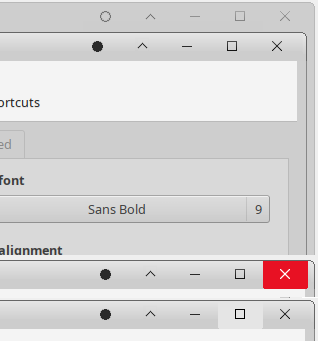
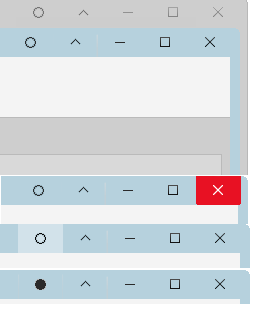
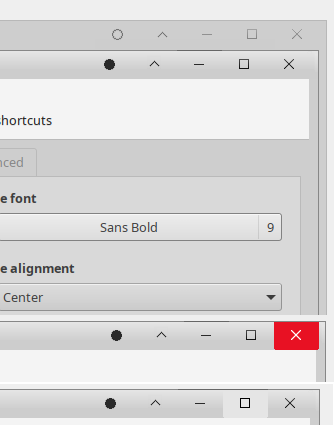

Description:
=============
For easier window resizing I added wide borders.
For easier button clicking I added big buttons (Windows-like).

I try to tackle the problem of needing a very precise mouse aiming to handle windows.

Howto install:
==============

   1. Download from github (zip file)
   2. Extract content into 
      - ~/.local/share/themes
         - for current user only
      - /usr/share/themes
         - for all users
   3. Select Theme from Window Manager dialog

Screenshots
===========
There are various variations of this Theme

Change history
=============
####1.3
- Added grey border on inactive windows
- Added blue style

####1.2
Made two version:
- One has non-round corners for inactive windows
- One has round corners for inactive windows

####1.1
- Active window: added dark grey border on all sides
- inactive windows: are now squared (I'm eager to get feedback)
- Top bar: is now properly colored 

